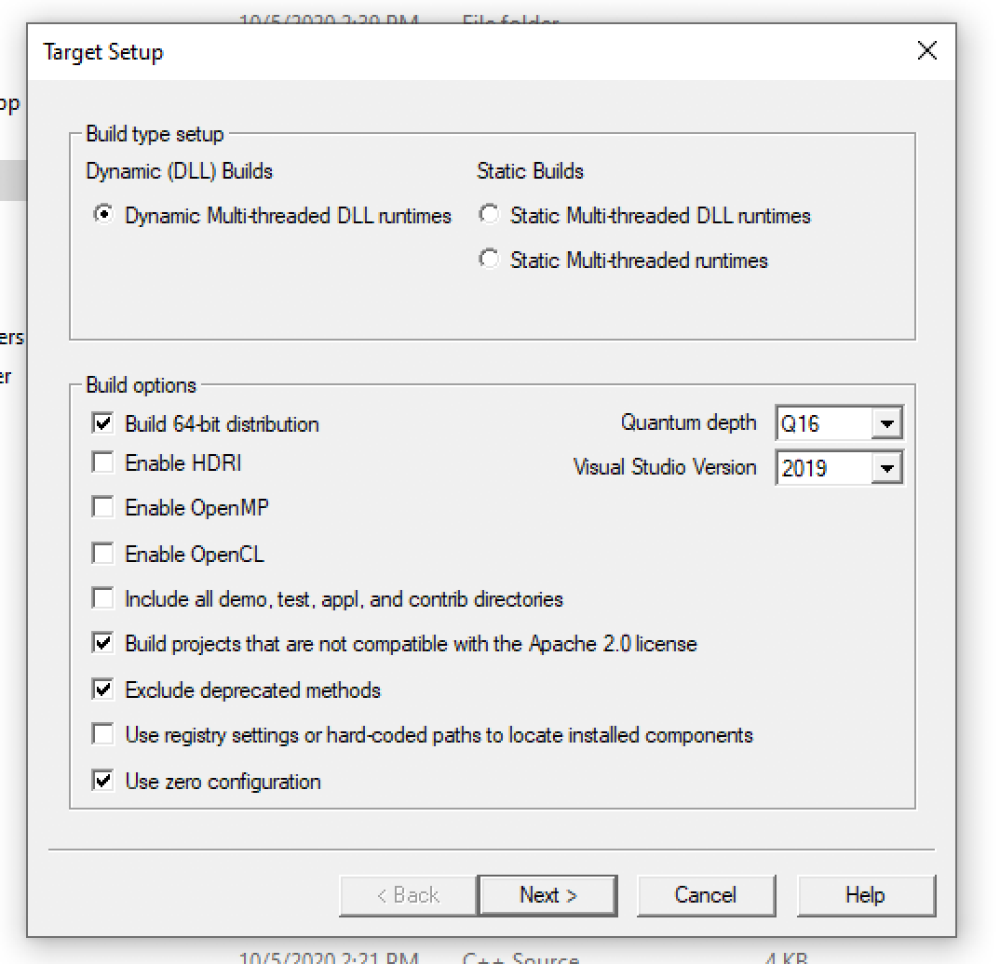
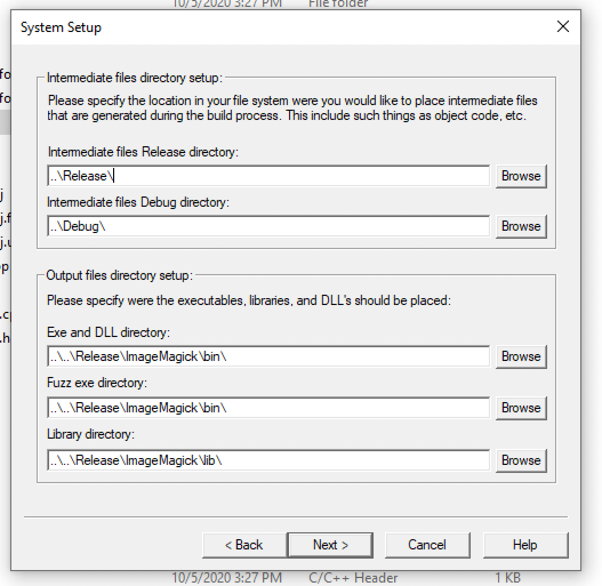

# ImageMagick

1. Clone https://github.com/ImageMagick/ImageMagick-Windows
2. Run "CloneRepositories.cmd"
3. **Fix "VisualMagick\configure\configure.sln"**
   - Make sure that generated value for `GenerateDebugInformation` is always equals true.<br>
     This will enable PDB generation in ImageMagick solution projects.<br>
     For example, change in ProjectFile.cpp:
     ```
     file << "      <GenerateDebugInformation>" << (debug ? "true" : "false") << "</GenerateDebugInformation>" << endl;
     ```
     to:
     ```
     file << "      <GenerateDebugInformation>" << "true" << "</GenerateDebugInformation>" << endl;
     ```
4. Build release configuration of "VisualMagick\configure\configure.sln"
5. Run "VisualMagick\configure\configure.exe"
6. Select this configuration:<br>
   <br>
   `..\..\Release\ImageMagick\bin\`<br>
   `..\..\Release\ImageMagick\lib\`<br>
   <br>
7. Open "VisualMagick\VisualDynamicMT.sln"
8. **Make sure that PDB generation enabled**<br>
   Open context menu for any project > Properties > Linker > Debugging<br>
   `Generate Debug Info` should be `Generate Debug Information(/DEBUG)`
9. **Fix code to doesn't prevent external crash handler**
   - ImageMagick\MagickCore\nt-base.c (comment SetUnhandledExceptionFilter)
   - Make sure that `MagickCoreGenesis` function doesn't call `Set signal handlers` no matter what value passed for establish_signal_handlers<br>
     Change<br>
     ```
     if (establish_signal_handlers != MagickFalse)
     ```
     to:
     ```
     if (MagickFalse)
     ```
10. Build release configuration of "VisualMagick\VisualDynamicMT.sln"
11. Execute GenerateImageMagickIncludeFolder.sh from ImageMagick-Windows repo folder
12. Remove all exe and related PDB files in "Release\ImageMagick\bin".<br>
    To make sure that everuthing is ok - count of files inside bin and lib folders should be equal.
13. Zip "Release\ImageMagick" folder
